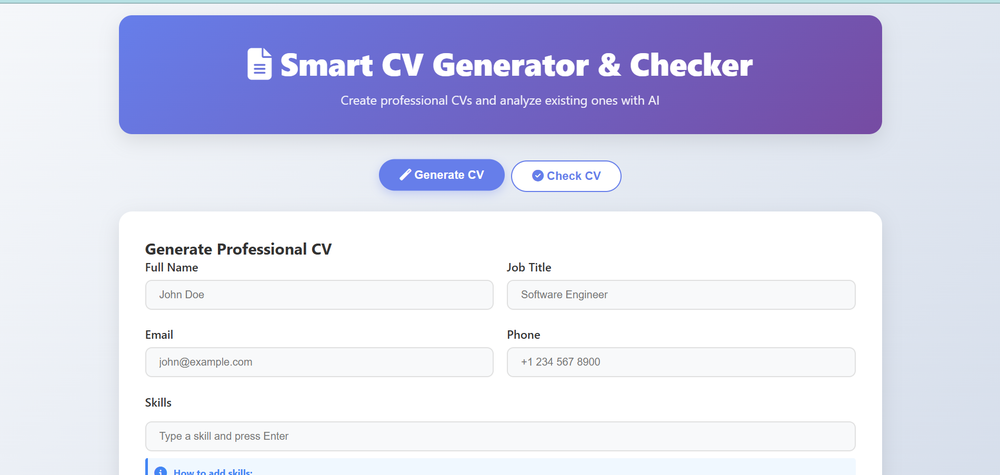
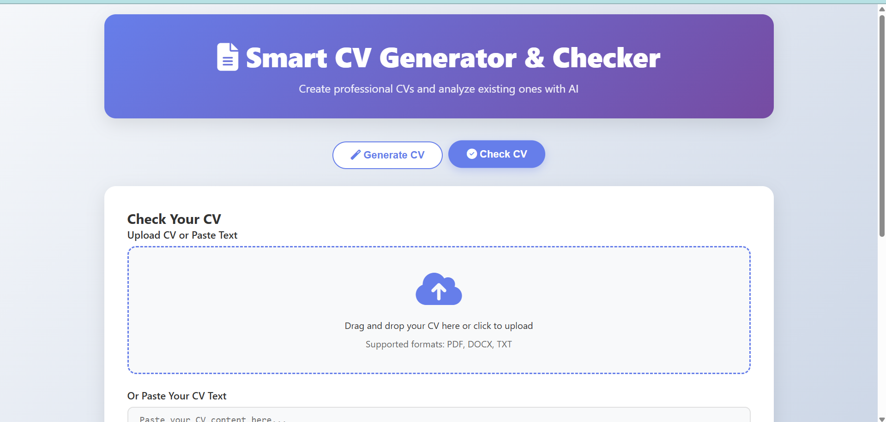

# 🚀 Smart CV Generator & Checker

<div align="center">
  
  
  
  

  <p align="center">
    <b>Create professional CVs with AI and analyze existing ones for improvements</b><br>
    <i>Powered by Google's Gemini for content generation and Groq's Llama3 for analysis</i>
  </p>

  <a href="#-features"></a>
  <a href="#-quick-start"></a>
  <a href="#-api-documentation"></a>
  <a href="#-deployment"></a>
</div>

---

## ✨ Features

### 📝 CV Generator
- **AI-Powered Content**: Professional summaries and bullet points generated by Gemini
- **Multiple Formats**: Export as PDF or DOCX
- **Style Options**: Professional, Modern, or Creative themes
- **Smart Formatting**: Auto-structured sections with optimal layout
- **Real-time Preview**: See your professional summary before download

### 🔍 CV Checker
- **ATS Optimization**: Score your CV for Applicant Tracking Systems
- **Comprehensive Analysis**: Overall score, strengths, and weaknesses
- **Keyword Analysis**: Missing keywords for your target job
- **Improvement Suggestions**: Specific, actionable recommendations
- **Grammar Check**: Identify language and formatting issues

## 🎯 How It Works

1. **CV Generation**: Uses Google's Gemini AI (`gemini-2.0-flash`) to create coherent, professional content
2. **CV Analysis**: Uses Groq's Llama3 (`llama3-70b-8192`) for fast, detailed analysis
3. **Document Creation**: Python libraries (`python-docx`, `reportlab`) for professional formatting

## 🛠️ Tech Stack

| Component | Technology | Purpose |
|-----------|------------|---------|
| **Backend** | FastAPI + Python | High-performance API server |
| **AI Models** | Gemini & Groq APIs | Content generation & analysis |
| **Document Gen** | python-docx, ReportLab | DOCX and PDF creation |
| **Frontend** | HTML/CSS/JS | Modern, responsive interface |
| **Deployment** | Railway | Cloud hosting platform |

## 🚀 Quick Start

### Prerequisites
- Python 3.11+
- [Gemini API Key](https://makersuite.google.com/app/apikey) (free)
- [Groq API Key](https://console.groq.com/keys) (free)

### Local Setup

1. **Clone the repository**
   ```bash
   git clone https://github.com/omara2001/CVResume-Generator-Checker-Tool.git
   cd smart-cv-generator
   ```

2. **Install dependencies**
   ```bash
   cd backend
   pip install -r requirements.txt
   ```

3. **Set environment variables**
   ```bash
   export GEMINI_API_KEY=your_gemini_api_key
   export GROQ_API_KEY=your_groq_api_key
   ```

4. **Run the backend**
   ```bash
   uvicorn main:app --reload
   ```

5. **Open the frontend**
   ```bash
   cd ..
   python -m http.server 8000
   ```

   Visit http://localhost:8000

## 📖 API Documentation

### Endpoints

| Endpoint | Method | Description |
|----------|--------|-------------|
| `/generate-cv` | POST | Generate a new CV |
| `/review-cv` | POST | Analyze an existing CV |
| `/upload-cv` | POST | Upload CV file for analysis |
| `/download/{id}` | GET | Download generated CV |
| `/health` | GET | API health check |

### Generate CV Request

```json
{
  "name": "John Doe",
  "email": "john@example.com",
  "phone": "+1234567890",
  "job_title": "Software Engineer",
  "skills": ["Python", "JavaScript", "React"],
  "experience": [
    {
      "company": "Tech Corp",
      "role": "Senior Developer",
      "duration": "2020-2023",
      "description": "Led development team..."
    }
  ],
  "education": [
    {
      "degree": "BS Computer Science",
      "institution": "Tech University",
      "year": "2020"
    }
  ],
  "style": "professional"
}
```

### Review CV Request

```json
{
  "cv_text": "Your CV content here...",
  "target_job": "Software Engineer at Google",
  "check_type": "full"
}
```

## 🚂 Deployment

### Railway Deployment

1. **Fork this repository**

2. **Create Railway account** at [railway.app](https://railway.app)

3. **Create new project**
   - Click "New Project"
   - Select "Deploy from GitHub"
   - Choose your forked repository

4. **Set environment variables**
   ```
   GEMINI_API_KEY=your_gemini_api_key
   GROQ_API_KEY=your_groq_api_key
   ```

5. **Deploy**
   - Railway automatically detects and deploys the Python app
   - Get your deployment URL from Railway dashboard

6. **Update frontend**
   - Update `API_URL` in the frontend with your Railway URL
   - Deploy frontend to GitHub Pages or Netlify

## 🔧 Configuration

### Environment Variables

| Variable | Description | Required |
|----------|-------------|----------|
| `GEMINI_API_KEY` | Google Gemini API key | ✅ |
| `GROQ_API_KEY` | Groq API key | ✅ |
| `PORT` | Server port (auto-set by Railway) | ❌ |

### Customization Options

- **CV Styles**: Modify document templates in `create_docx_cv()` and `create_pdf_cv()`
- **Analysis Criteria**: Adjust prompts in `review_cv()` endpoint
- **UI Theme**: Modify CSS variables in the frontend
- **File Formats**: Add support for more export formats

## 📸 Screenshots

<div align="center">
  <table>
    <tr>
      <td width="50%">
        
        <p align="center"><b>CV Generator Interface</b></p>
      </td>
      <td width="50%">
        
        <p align="center"><b>CV Analysis Results</b></p>
      </td>
    </tr>
  </table>
</div>

## 🤝 Contributing

1. Fork the repository
2. Create your feature branch (`git checkout -b feature/amazing-feature`)
3. Commit changes (`git commit -m 'Add amazing feature'`)
4. Push to the branch (`git push origin feature/amazing-feature`)
5. Open a Pull Request

## 📈 Roadmap

- [ ] LinkedIn profile import
- [ ] Multiple language support
- [ ] Industry-specific templates
- [ ] Cover letter generator
- [ ] Interview preparation tips
- [ ] Job matching suggestions
- [ ] CV version history
- [ ] Collaborative editing

## 🐛 Troubleshooting

<details>
<summary><b>Common Issues</b></summary>

### API Key Errors
- Verify both API keys are correctly set
- Check if you have remaining quota
- Ensure keys have proper permissions

### Document Generation Issues
- Check if all required fields are filled
- Verify file write permissions
- Ensure proper formatting in input data

### Deployment Problems
- Verify all environment variables are set
- Check Railway logs for errors
- Ensure correct Python version (3.11+)

### Frontend Issues
- Check browser console for JavaScript errors
- Ensure the API_URL in script.js is correct (no trailing slash)
- Verify CORS is properly configured on the backend
- Try clearing browser cache and cookies

</details>

## 📄 License

This project is licensed under the MIT License - see the [LICENSE](LICENSE) file for details.

## 🙏 Acknowledgments

- **Google Gemini** - AI content generation
- **Groq** - Fast inference for CV analysis
- **Meta** - Llama3 language model
- **FastAPI** - Modern Python framework
- **Railway** - Simple deployment platform

---

<div align="center">
  <p>
    <b>Built with ❤️ to help job seekers succeed</b><br>
    <sub>If you find this helpful, please give it a ⭐</sub>
  </p>

  <a href="https://github.com/omara2001/CVResume-Generator-Checker-Tool">
    
  </a>
</div>